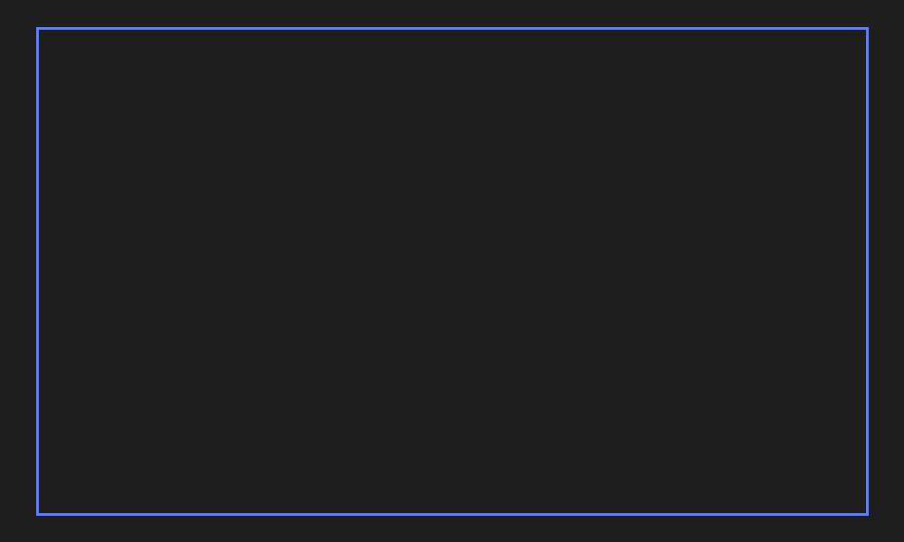

 

<h1>🚀 Software Engineer | System Designer | Problem Solver</h1>

<!-- Animated Typing Effect -->

  
  
  
  

---

<h2>✨ About Me</h2>

I'm a **Full-Stack Software Engineer** with deep expertise in **System Design**, **Data Structures & Algorithms**, and **Backend Development**. I solve complex computational problems and design scalable distributed systems. With a strong foundation from IIT Dharwad and practical experience at industry-leading companies, I build efficient solutions that impact millions.

🎯 Optimizing systems • 🧮 Crafting elegant algorithms • 🔧 Building at scale • 📚 Always learning

---

<h2>💼 Professional Experience</h2>

### 🔷 **Software Engineer @ Paytm**
Building robust backend systems, designing scalable microservices, optimizing payment infrastructure

### 🔶 **SDE Intern @ Altair Engineering**
Developed innovative software solutions, worked on production-level systems, collaborated across teams

---

<h2>🎓 Education</h2>

**Bachelor of Technology (B.Tech) in Computer Science & Engineering**  
IIT Dharwad | 2023 | Dharwad, Karnataka, India

---

<h2>💻 Technical Skills</h2>

**Programming Languages**  

**Core Competencies**  

**Frameworks & Tools**  

---

<h3>🖥️ OS Simulator - AGNI</h3>

A comprehensive OS simulator implementing core operating system concepts including process scheduling algorithms (FCFS, SJF, Round Robin), memory allocation, paging, and CPU scheduling strategies.

**Tech Stack:** `C++` `Python` `Linked Lists` `Graphs` `Trees`  
🔗 [GitHub Repository](https://github.com/Newtanmukh/AGNI)

<h3>🛡️ Malware Analysis with ML - RND</h3>

Advanced cybersecurity project leveraging machine learning for malware detection and behavioral analysis. Implements sophisticated algorithms for threat classification and pattern recognition.

**Tech Stack:** `Python` `Machine Learning` `Deep Learning` `Data Analysis`  
🔗 [GitHub Repository](https://github.com/Newtanmukh/RND)

<h3>⚙️ Pipelined Processor</h3>

Simulated a complete pipelined processor architecture following the ToyRISC instruction set. Demonstrates understanding of computer architecture and performance optimization.

**Tech Stack:** `Computer Architecture` `Hardware Design` `Assembly`  
🔗 [GitHub Repository](https://github.com/Newtanmukh/Pipelined_Processor)

<h3>🧮 DSA Mastery - Java Edition</h3>

Curated collection of essential Data Structures and Algorithms problems covering Dynamic Programming, Graph Algorithms, Tree Structures, Sliding Window, and advanced data structures.

**Tech Stack:** `Java` `DSA` `Algorithms`  
🔗 [GitHub Repository](https://github.com/Newtanmukh/DSA-Using-Java)

<h3>🐍 Python Frameworks & ML Tutorials</h3>

Comprehensive learning resource covering Python frameworks, machine learning, and deep learning implementations with real-world projects.

**Tech Stack:** `Python` `Flask` `Django` `TensorFlow` `PyTorch`  
🔗 [GitHub Repository](https://github.com/Newtanmukh/Python-Frameworks-Tutorials)

<h3>🛒 Other Notable Projects</h3>

### Online BookStore
Full-featured e-commerce platform | `Java` `JDBC` `JSP` `SQL` | [Repo](https://github.com/Newtanmukh/Online-BookStore-Website)

### Chat Application  
Real-time messaging | `Node.js` `Socket.IO` `JavaScript` | [Repo](https://github.com/Newtanmukh/Chat-App-using-NodeJS-and-SocketIO)

### Compiler Design - Lex & Bison
Compiler tools exploration | `Lex` `Bison` | [Repo](https://github.com/Newtanmukh/Using-Lex-and-Bison)

### Competitive Programming
LeetCode & DSA | `C++` | [Repo](https://github.com/Newtanmukh/DSA-Problems)

---

---

<h2>🎯 Currently</h2>

🔭 Exploring advanced System Design & Distributed Systems Architecture  
🌱 Learning Kubernetes, Microservices Patterns, Advanced Database Optimization  
👯 Collaborating on open-source projects & innovative initiatives  
💡 Building next-generation solutions at Paytm  

<h2>⚡ Fun Facts</h2>

🎖️ Passionate about algorithmic problem-solving and optimization  
🔬 Enthusiast of system design and distributed computing  
📚 Continuous learner embracing cutting-edge technologies  
🏆 Believer in clean code, SOLID principles, and best practices  
🤝 Active contributor to tech communities  
🎨 Attention to detail in logic and user experience  

---

 

  

